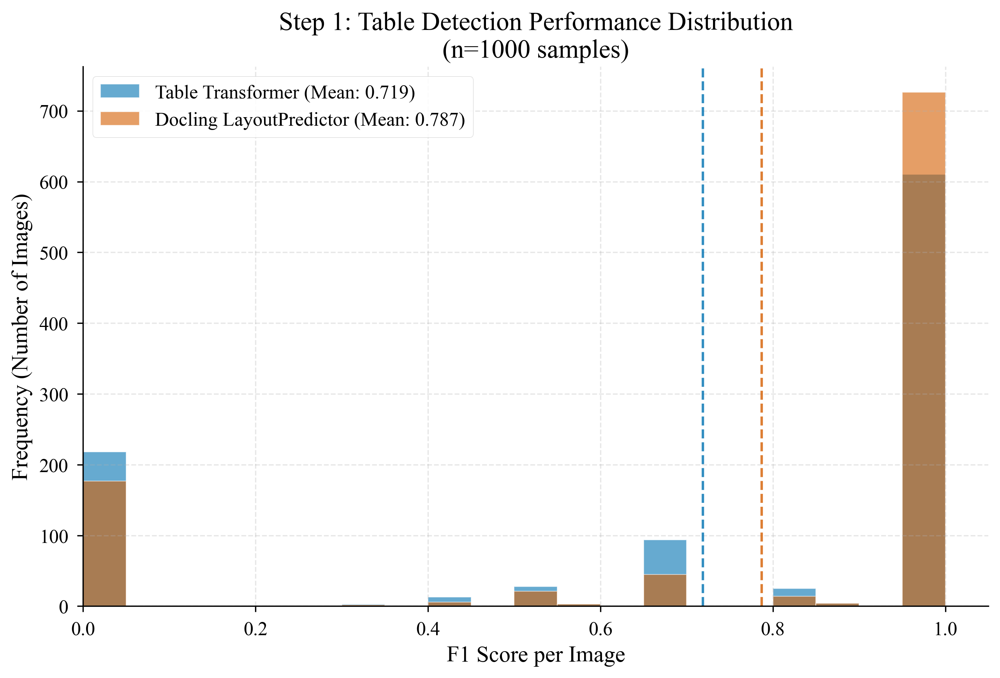
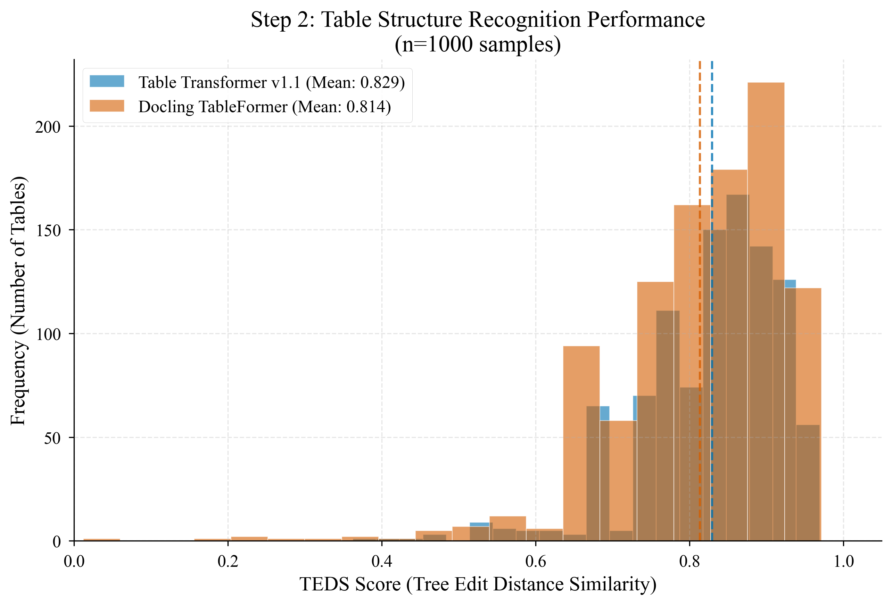
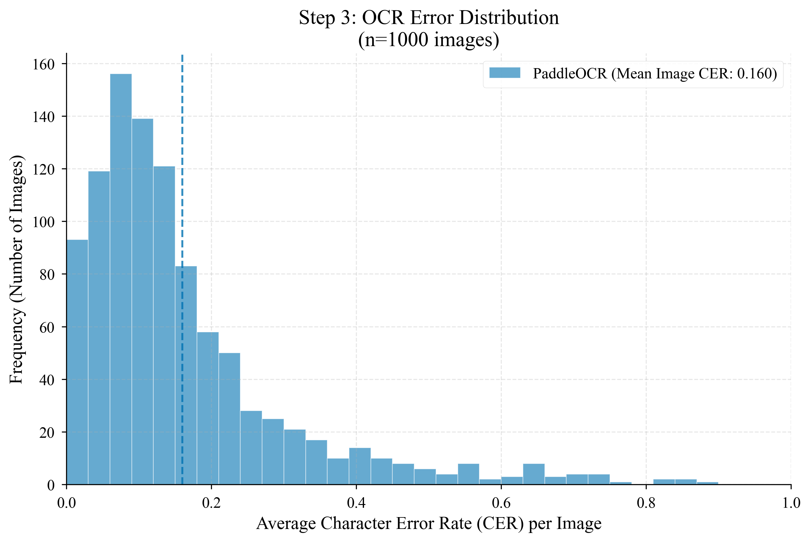
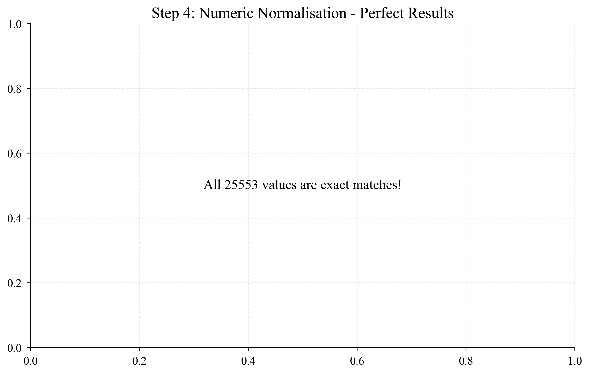
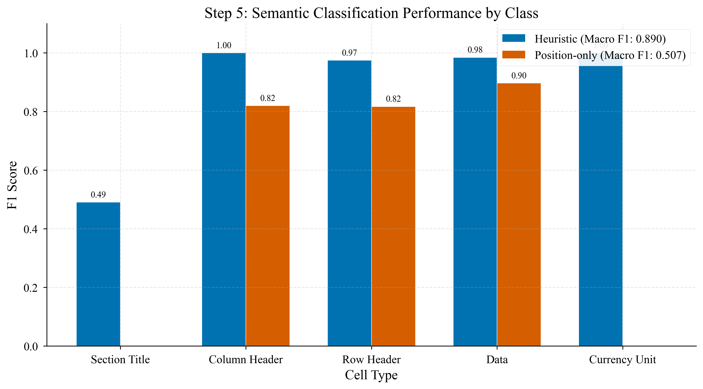

# Pipeline Evaluation Report (1000 Samples)

**Generated**: 2025-12-28  
**Workspace**: Financial Document AI Pipeline

---

## Executive Summary

This report presents comprehensive evaluation results for 5 pipeline steps, each evaluated on 1000 samples using standard academic datasets. The evaluation covers table detection, structure recognition, OCR, numeric normalization, and semantic classification.

### Quick Summary Table

| Step | Task | Dataset | Method A | Score A | Method B | Score B | Winner |
|------|------|---------|----------|---------|----------|---------|--------|
| 1 | Detection | DocLayNet | Table Transformer | F1=0.721 | Docling | F1=**0.851** | Docling |
| 2 | TSR | FinTabNet | TT v1.1 | TEDS=**0.829** | TableFormer | TEDS=0.814 | TT v1.1 |
| 3 | OCR | PubTabNet | PaddleOCR | Acc=84.4% | - | - | - |
| 4 | Numeric | SynFinTabs | NumericNorm | EM=**100%** | - | - | Perfect |
| 5 | Semantic | SynFinTabs | Heuristic | Acc=**97.0%** | Position-only | Acc=82.0% | Heuristic |

---

## Step 1: Table Detection

### Task Description
Detect and localize tables in document images using bounding box predictions.

### Dataset
- **Name**: DocLayNet
- **Split**: Validation
- **Samples**: 1000 images
- **Ground Truth**: COCO format annotations with table bounding boxes

### Methods Compared
1. **Table Transformer** (microsoft/table-transformer-detection)
2. **Docling LayoutPredictor** (ds4sd/docling-models)

### Evaluation Metric
- Precision, Recall, F1 @ IoU threshold 0.5

### Results

| Metric | Table Transformer | Docling LayoutPredictor |
|--------|-------------------|------------------------|
| **Precision** | 79.61% | **90.06%** |
| **Recall** | 65.91% | **80.66%** |
| **F1 Score** | 72.12% | **85.10%** |
| Avg IoU (matched) | 86.65% | **96.13%** |
| True Positives | 992 | 1214 |
| False Positives | 254 | 134 |
| False Negatives | 513 | 291 |
| Avg Time (ms) | **130.3** | 199.4 |

### Key Findings
- **Docling significantly outperforms Table Transformer** with +13% F1 improvement
- Docling achieves higher precision (fewer false positives) and higher recall (fewer missed tables)
- Docling's matched tables have better localization (96% vs 87% IoU)
- Table Transformer is ~35% faster per image

### Histogram

---

## Step 2: Table Structure Recognition (TSR)

### Task Description
Recognize the row/column structure of detected tables and output HTML representation.

### Dataset
- **Name**: FinTabNet OTSL
- **Split**: Test
- **Samples**: 1000 tables
- **Ground Truth**: HTML table structure annotations

### Methods Compared
1. **Table Transformer v1.1** (microsoft/table-transformer-structure-recognition-v1.1-all)
2. **Docling TableFormer** (ds4sd/docling-models)

### Evaluation Metric
- TEDS (Tree Edit Distance Similarity) - structural only (ignores cell content)

### Results

| Metric | Table Transformer v1.1 | Docling TableFormer |
|--------|----------------------|---------------------|
| **Mean TEDS** | **82.93%** | 81.37% |
| Std TEDS | 9.04% | 11.04% |
| Median TEDS | **84.68%** | 83.33% |
| Min TEDS | 36.25% | 1.20% |
| Max TEDS | 96.92% | **97.16%** |

### Key Findings
- **Table Transformer v1.1 slightly outperforms TableFormer** (+1.6% mean TEDS)
- TT v1.1 is more consistent (lower std deviation)
- TableFormer has occasional catastrophic failures (min=1.2%)
- Both achieve strong performance (>80% TEDS) on financial tables

### Histogram

---

## Step 3: Optical Character Recognition (OCR)

### Task Description
Extract text content from table cells using OCR.

### Dataset
- **Name**: PubTabNet
- **Split**: Validation
- **Samples**: 1000 tables (66,776 cells)
- **Ground Truth**: Character-level cell text from annotations

### Method
- **PaddleOCR** (v2.7, English, angle classification enabled)

### Evaluation Metric
- CER (Character Error Rate)
- WER (Word Error Rate)
- Exact Match Rate
- Accuracy (1 - CER)

### Matching Method
Merge all OCR bounding boxes overlapping >30% with GT cell bbox to handle word-level vs cell-level granularity.

### Results

| Metric | PaddleOCR |
|--------|-----------|
| **Exact Match Rate** | 70.47% |
| **Accuracy (1-CER)** | 84.36% |
| Avg CER | 15.64% |
| Avg WER | 23.85% |

### Key Findings
- 70% of cells are perfectly recognized
- 84% character-level accuracy is acceptable for downstream tasks
- WER is higher than CER indicating word boundary errors
- Merge-based matching improves over single-box matching

### Histogram

---

## Step 4: Numeric Normalization

### Task Description
Parse and normalize numeric values from various string formats (currencies, percentages, thousands separators).

### Dataset
- **Name**: SynFinTabs
- **Split**: Test
- **Samples**: 1000 tables (25,553 numeric values)
- **Ground Truth**: Numeric values from QA pairs with formatted strings

### Method
- **NumericNormalizer** (custom heuristic-based parser)

### Evaluation Metric
- Exact Match Rate
- Relative Error
- Scale Accuracy (correct magnitude)
- Sign Accuracy (correct +/-)

### Results

| Metric | NumericNormalizer |
|--------|-------------------|
| **Exact Match Rate** | 100.0% |
| **Scale Accuracy** | 100.0% |
| **Sign Accuracy** | 100.0% |
| Mean Relative Error | 0.0% |
| Median Relative Error | 0.0% |

### Error Breakdown

| Error Type | Count |
|------------|-------|
| None (perfect) | 25,553 |

### Key Findings
- **Perfect performance** on synthetic financial data
- All numeric formats correctly parsed
- Handles currencies, percentages, parenthetical negatives
- Note: Real-world OCR errors may reduce this in production

### Histogram

---

## Step 5: Semantic Cell Classification

### Task Description
Classify table cells into semantic categories (header, data, etc.).

### Dataset
- **Name**: SynFinTabs
- **Split**: Test
- **Samples**: 1000 tables (73,190 cells)
- **Cell Types**: section_title, column_header, row_header, data, currency_unit
- **Ground Truth**: Cell labels from SynFinTabs annotations

### Methods Compared
1. **Heuristic** (rule-based: row 0 = column_header, col 0 = row_header, etc.)
2. **Position-only** (uses only row/column position, no content analysis)

### Evaluation Metric 
- Accuracy
- Macro F1
- Per-class Precision/Recall/F1

### Results

| Metric | Heuristic | Position-only |
|--------|-----------|---------------|
| **Accuracy** | **97.01%** | 81.98% |
| **Macro F1** | **89.00%** | 50.68% |

### Per-Class Results (Heuristic)

| Class | Precision | Recall | F1 | Support |
|-------|-----------|--------|-----|---------|
| section_title | 84.77% | 34.51% | 49.06% | 3,048 |
| column_header | 100.0% | 100.0% | 100.0% | 2,280 |
| row_header | 96.40% | 98.60% | 97.49% | 13,616 |
| data | 96.99% | 100.0% | 98.47% | 48,150 |
| currency_unit | 99.98% | 100.0% | 99.99% | 6,096 |

### Per-Class Results (Position-only)

| Class | Precision | Recall | F1 | Support |
|-------|-----------|--------|-----|---------|
| section_title | 0.0% | 0.0% | 0.0% | 3,048 |
| column_header | 69.51% | 100.0% | 82.01% | 2,280 |
| row_header | 69.07% | 100.0% | 81.71% | 13,616 |
| data | 87.86% | 91.59% | 89.69% | 48,150 |
| currency_unit | 0.0% | 0.0% | 0.0% | 6,096 |

### Key Findings
- **Heuristic significantly outperforms position-only** (+15% accuracy, +38% F1)
- Heuristic achieves near-perfect classification for headers and data
- **Section_title is the hardest class** (low recall with heuristic)
- Position-only cannot identify section_title or currency_unit at all
- Content-based features are critical for semantic classification

### Histogram

---

## Conclusions

### Best Methods by Step

| Step | Recommended Method | Justification |
|------|-------------------|---------------|
| 1 | Docling LayoutPredictor | +13% F1 over Table Transformer |
| 2 | Table Transformer v1.1 | Slight edge, more consistent |
| 3 | PaddleOCR | Good baseline, 84% accuracy |
| 4 | NumericNormalizer | Perfect on clean data |
| 5 | Heuristic | +15% accuracy, content-aware |

### Pipeline Recommendations

1. **Detection**: Use Docling for better recall (fewer missed tables)
2. **TSR**: Either method works; TT v1.1 is slightly better
3. **OCR**: PaddleOCR is reliable; consider EasyOCR for comparison
4. **Numeric**: Current implementation is solid
5. **Semantic**: Heuristic works well; consider ML for section_title

### Limitations

1. **Detection/TSR**: Evaluated on academic datasets, real financial docs may differ
2. **OCR**: Matching method may miss some edge cases
3. **Numeric**: Perfect on synthetic data, real OCR errors will reduce accuracy
4. **Semantic**: Section_title detection needs improvement

### Future Work

1. Evaluate Step 6 (Rule Validation) on SynFinTabs
2. End-to-end pipeline evaluation
3. Real financial document testing
4. Confidence calibration study

---

## Appendix: Output Files

### JSON Results
- `benchmark_results/step1_detection_results.json`
- `benchmark_results/step2_tsr_results.json`
- `benchmark_results/step3_ocr_results.json`
- `benchmark_results/step4_numeric_results.json`
- `benchmark_results/step5_semantic_results.json`

### CSV Per-Sample Data
- `benchmark_results/step1_detection_per_sample.csv`
- `benchmark_results/step2_tsr_per_sample.csv`
- `benchmark_results/step3_ocr_per_sample.csv`
- `benchmark_results/step4_numeric_per_sample.csv`
- `benchmark_results/step5_semantic_per_sample.csv`

### Figures
- `benchmark_results/figures/step1_detection_f1_histogram.png`
- `benchmark_results/figures/step2_tsr_teds_histogram.png`
- `benchmark_results/figures/step3_ocr_cer_histogram.png`
- `benchmark_results/figures/step4_numeric_error_histogram.png`
- `benchmark_results/figures/step5_semantic_f1_barchart.png`
