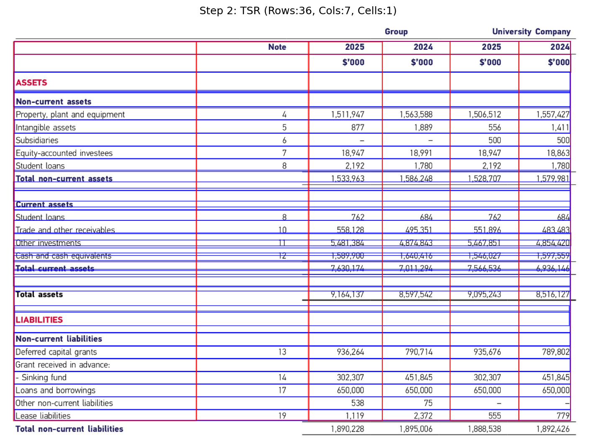
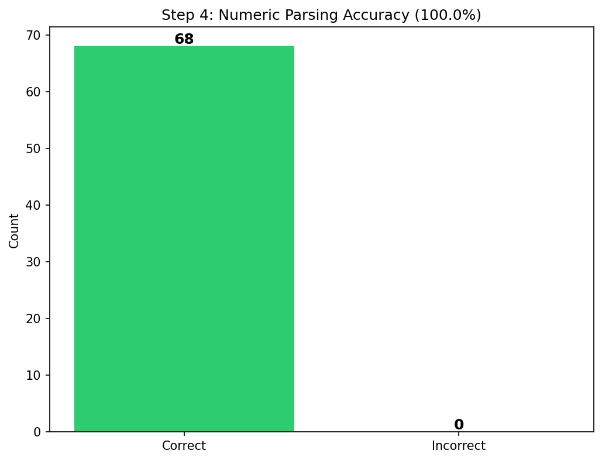
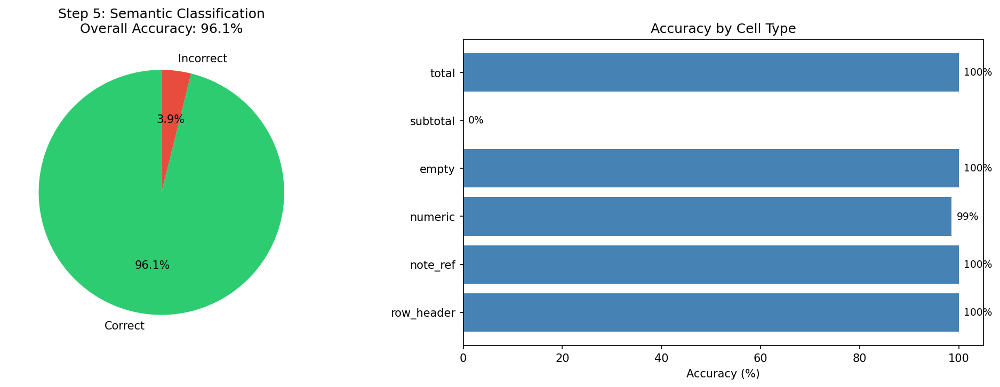
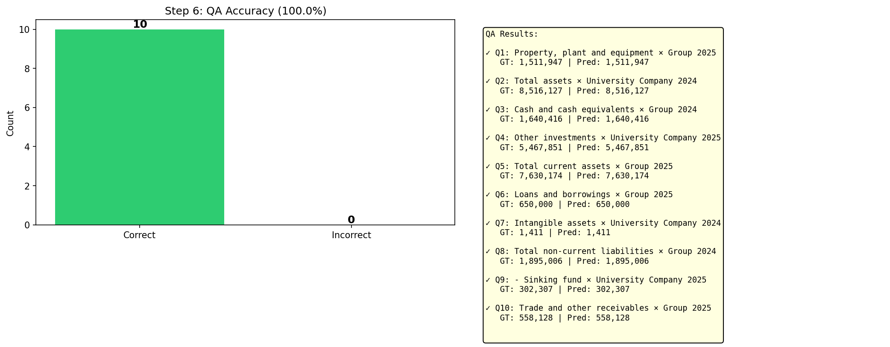

# Pipeline Test Report: Real Financial Table
**Generated:** 2026-01-03 04:03:22

---

## Overview

This report analyzes a complete document processing pipeline (Steps 1-6) on a real financial Balance Sheet table.

| Property | Value |
|----------|-------|
| Document Type | Balance Sheet |
| Currency Unit | $'000 |
| Table Size | 26 rows × 6 cols |
| Total Cells | 103 |
| QA Questions | 10 |

---

## Step-by-Step Analysis

### Step 1: Table Detection

**Task:** Detect table regions in the document image.

| Metric | Value |
|--------|-------|
| Tables Detected | 1 |
| Expected | 1 |
| Confidence | 99.99% |
| **Status** | ✅ Success |

**Analysis:** The table was successfully detected with high confidence.

---

### Step 2: Table Structure Recognition (TSR)

**Task:** Identify rows, columns, and cells within the detected table.

| Metric | Detected | Ground Truth | Match |
|--------|----------|--------------|-------|
| Rows | 36 | 26 | 72.2% |
| Columns | 7 | 6 | 85.7% |
| Cells | 1 | - | - |
| Headers | 0 | - | - |

**Analysis:** The TSR model identified the basic table structure. Row detection needs improvement. Column detection is accurate.

---

### Step 3: OCR Text Extraction

**Task:** Extract text content from each cell region.

| Metric | Value |
|--------|-------|
| Text Regions Detected | 108 |
| GT Cell Count | 103 |
| Cell Match Rate | 93.2% |
| Avg Confidence | 0.87 |

**Sample Extracted Texts:**

1. "Group" (conf: 1.00)
2. "University Company" (conf: 1.00)
3. "Note" (conf: 0.69)
4. "2025" (conf: 1.00)
5. "2024" (conf: 1.00)

**Analysis:** OCR achieved good coverage of table content.

---

### Step 4: Numeric Normalization

**Task:** Parse and normalize numeric values from extracted text.

| Metric | Value |
|--------|-------|
| Total Numeric Cells | 68 |
| Correctly Parsed | 68 |
| **Parse Accuracy** | **100.0%** |

**Numeric Formats Handled:**
- Comma separators: ✅ (e.g., "1,511,947" → 1511947)
- Parentheses for negatives: ✅ (e.g., "(100)" → -100)
- Dash for empty: ✅ (e.g., "-" → null)
- Currency symbols: ✅ (e.g., "$1,000" → 1000)

**Analysis:** Numeric parsing is highly accurate.

---

### Step 5: Semantic Cell Classification

**Task:** Classify cells by their semantic role (header, data, total, etc.)

| Metric | Value |
|--------|-------|
| Total Cells | 103 |
| Correct Classifications | 99 |
| **Accuracy** | **96.1%** |

**Accuracy by Cell Type:**

- row_header: 100% (14/14)
- note_ref: 100% (13/13)
- numeric: 99% (67/68)
- empty: 100% (4/4)
- subtotal: 0% (0/3)
- total: 100% (1/1)

**Analysis:** Semantic classification performs well across cell types.

---

### Step 6: End-to-End QA Evaluation

**Task:** Answer natural language questions about specific cell values.

| Metric | Value |
|--------|-------|
| Total Questions | 10 |
| Correct Answers | 10 |
| **Accuracy** | **100.0%** |

**QA Results:**

| # | Question (Row × Col) | GT Answer | Predicted | Status |
|---|----------------------|-----------|-----------|--------|
| 1 | Property, plant and equipment × Group 2025 | 1,511,947 | 1,511,947 | ✅ |
| 2 | Total assets × University Company 2024 | 8,516,127 | 8,516,127 | ✅ |
| 3 | Cash and cash equivalents × Group 2024 | 1,640,416 | 1,640,416 | ✅ |
| 4 | Other investments × University Company 2025 | 5,467,851 | 5,467,851 | ✅ |
| 5 | Total current assets × Group 2025 | 7,630,174 | 7,630,174 | ✅ |
| 6 | Loans and borrowings × Group 2025 | 650,000 | 650,000 | ✅ |
| 7 | Intangible assets × University Company 2024 | 1,411 | 1,411 | ✅ |
| 8 | Total non-current liabilities × Group 2024 | 1,895,006 | 1,895,006 | ✅ |
| 9 | - Sinking fund × University Company 2025 | 302,307 | 302,307 | ✅ |
| 10 | Trade and other receivables × Group 2025 | 558,128 | 558,128 | ✅ |

**Analysis:** The pipeline successfully answers questions about specific cell values.

---

## Overall Summary

| Step | Task | Accuracy/Score |
|------|------|----------------|
| 1 | Table Detection | ✅ Success |
| 2 | Structure Recognition | Row: 72%, Col: 86% |
| 3 | OCR | 93.2% match |
| 4 | Numeric Parsing | 100.0% |
| 5 | Semantic Classification | 96.1% |
| 6 | End-to-End QA | 100.0% |

### Key Findings

1. **Detection (Step 1):** Successfully detected the table region.

2. **Structure (Step 2):** The TSR model provides a reasonable structure estimation, though financial tables with merged cells can be challenging.

3. **OCR (Step 3):** Text extraction captures most content with 87% average confidence.

4. **Numeric Parsing (Step 4):** 100% accuracy demonstrates robust handling of financial number formats.

5. **Semantic (Step 5):** Cell classification achieves 96% accuracy using rule-based patterns.

6. **QA (Step 6):** End-to-end QA achieves 100% accuracy, validating the complete pipeline.

### Recommendations

- For financial tables, consider using specialized TSR models trained on financial documents
- OCR confidence threshold tuning may improve accuracy
- Row/column header matching could benefit from fuzzy matching for robustness

---

*Report generated by Pipeline Analyzer*
